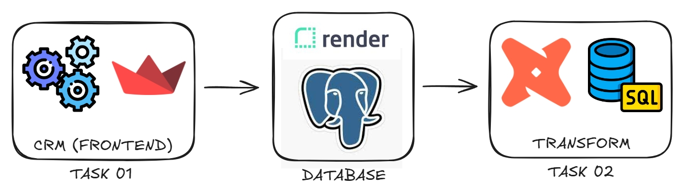
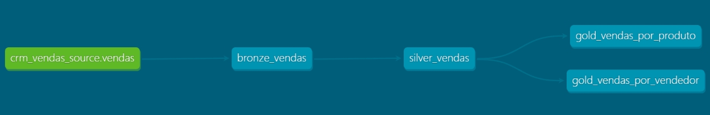

# Projeto de CRM de Vendas

Sistema de CRM de Vendas para registrar e analisar os dados de vendas realizadas em um período específico, utilizando uma arquitetura moderna de ELT (Extract, Load and Transform).



## Índice

- [Documentação](https://ianlucasch.github.io/crm-de-vendas/)
- [Sobre o projeto](#sobre-o-projeto)
- [Como funciona](#como-funciona)
   - [Estrutura de diretórios](#estrutura-de-diretórios)
- [Como executar](#como-executar)
- [Conclusão](#conclusão)

## Sobre o projeto

Este projeto tem como objetivo criar um sistema de CRM de Vendas para registrar e analisar os dados de vendas realizadas em um período específico. Esses dados são extraídos do CRM de Vendas, carregados diretamente no banco de dados [PostgreSQL](https://www.postgresql.org/download/) e posteriormente são tratados pelo [DBT Core](https://github.com/dbt-labs/dbt-core).

A plataforma [Render](https://render.com/) foi utilizada para subir um PostgreSQL Server na nuvem.

## Como funciona

**<u>Task 01:</u> Extrair os dados do CRM de Vendas e carregar no banco de dados**

O script `frontend` é responsável por criar um frontend simples através da biblioteca Streamlit para registrar os dados das vendas, e depois carregar esses dados diretamente no PostgreSQL, criando uma tabela `vendas` no banco de dados.

**<u>Task 02:</u> Transformar os dados**

O DBT Core é responsável pela limpeza e transformação dos dados. Após instalar o `dbt-postgres` e configurar o arquivo `profiles.yml`, o DBT se conecta ao banco de dados PostgreSQL para ter acesso as tabelas.

A pasta `models` define as transformações dos dados usando SQL. As transformações foram divididas em três camadas: bronze, silver e gold.



Para mais informações, acesse as pastas `dbt_crm_vendas/docs` onde contém toda a documentação do projeto DBT.

### Estrutura de diretórios

```
.
├── LICENSE
├── README.md
├── dbt_crm_vendas
│   ├── docs
│   │   └── homepage.md
│   ├── models
│   │   ├── bronze
│   │   │   ├── bronze_vendas.sql
│   │   │   └── schema.yml
│   │   ├── gold
│   │   │   ├── gold_vendas_por_produto.sql
│   │   │   ├── gold_vendas_por_vendedor.sql
│   │   │   └── schema.yml
│   │   ├── silver
│   │   │   ├── schema.yml
│   │   │   └── silver_vendas.sql
│   │   └── sources.yml
│   └── dbt_project.yml
├── docs
│   └── index.md
├── exemplo.env
├── imagens
│   ├── fluxograma-dbt.jpeg
│   └── fluxograma-elt.jpeg
├── mkdocs.yml
├── profiles.yml
├── pyproject.toml
├── requirements.txt
└── src
    ├── contrato.py
    ├── database.py
    └── frontend.py
```

## Como executar

Todas as etapas foram executadas no terminal `bash`.

1. Clone o repositório localmente:
   ```bash
   git clone https://github.com/ianlucasch/crm-de-vendas.git
   ```


2. Acesse a pasta do projeto:
   ```bash
   cd crm-de-vendas
   ```


3. Instale o python versão 3.12.3:
   ```bash
   pyenv install 3.12.3
   ```


4. Defina a versão local do python para 3.12.3:
   ```bash
   pyenv local 3.12.3
   ```


5. Crie um ambiente virtual e ative-o:
   ```bash
   python -m venv .venv
   source .venv/Scripts/activate
   ```


6. Instale todas as dependências do projeto:
   ```bash
   pip install -r requirements.txt
   ```


7. Execute o script `frontend`:
   ```bash
   streamlit run src/frontend.py
   ```


8. Crie um novo projeto DBT:
   ```bash
   dbt init dbt_crm_vendas
   cd dbt_crm_vendas
   ```


9. Configure a conexão com PostgreSQL:

   Configure o arquivo `profiles.yml` com suas variáveis de ambiente para conectar o DBT ao PostgreSQL. O arquivo deve estar no diretório `~/.dbt/` ou no diretório especificado pela variável de ambiente `DBT_PROFILES_DIR`.

   Exemplo de `profiles.yml`:
   ```yaml
   dbt_crm_vendas:
      outputs:
         dev:
            dbname: <DB_NAME>
            host: <DB_HOST>
            pass: <DB_PASS>
            port: <DB_PORT>
            schema: public
            threads: 1
            type: postgres
            user: <DB_USER>
      target: dev
   ```


10. Verifique o estado do projeto:
      ```bash
      dbt debug
      ```


11. Execute as transformações do DBT:
      ```bash
      dbt run
      ```

## Conclusão

Este README apresenta o passo a passo e as principais ferramentas utilizadas para a criação de um sistema de CRM de Vendas e transformação dos seus dados.